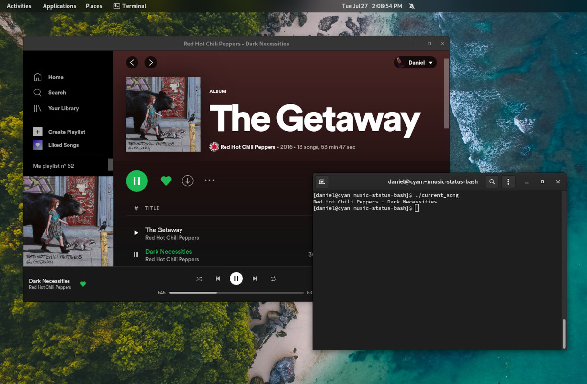

# music_status_bash
Parses current playing music to terminal on Linux, BSD and macOS. To use with dwm, or any other window manager to display current song simply add to the config file. Might need to increase the max length of a block, some song titles can be long.
## Installation
Does not really require any dependencies, simply download or use following curl command
### Optional dependencies
If you intend to use this script with web-based players such as Tidal, or anything else in the browser -- install **`playerctl`**

### Install steps
To clone this script into a directory and mark it as executable run the following commands 

`curl https://raw.githubusercontent.com/HonusDaniel/music-status-bash/main/current_song >> current_song`

 `chmod +x current_song`

 `./current_song`

---

## Supported players
As a very small fork of neofetch(yes), it supports most common audio players. Full list below.

* web based players in chromium based browsers (only tested in Brave)
* Spotify
* amarok
* audacious
* banshee
* bluemindo
* clementine
* cmus
* deadbeef
* deepin-music
* dragon
* elisa
* exaile
* gnome-music
* gmusicbrowser
* gogglesmm
* guayadeque
* io.elementary.music
* iTunes
* juk
* lollypop
* MellowPlayer
* mocp
* mopidy
* mpd
* muine
* netease-cloud-music
* olivia
* plasma-browser-integration
* playerctl
* pogo
* pragha
* qmmp
* quodlibet
* rhythmbox
* sayonara
* smplayer
* strawberry
* tauonmb
* tomahawk
* vlc
* xmms2d
* xnoise
* yarock
